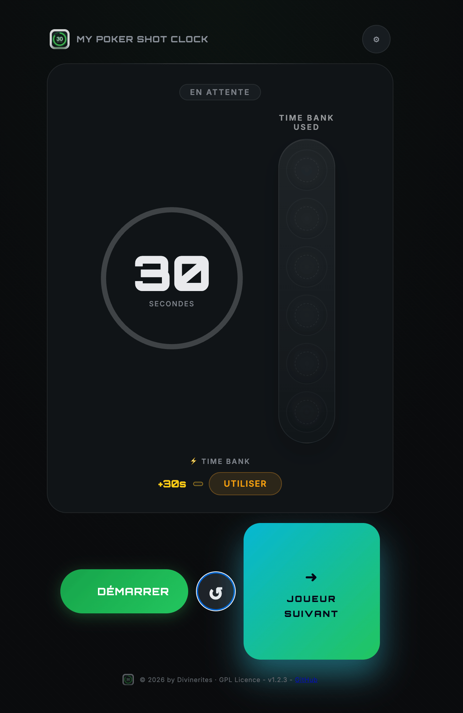
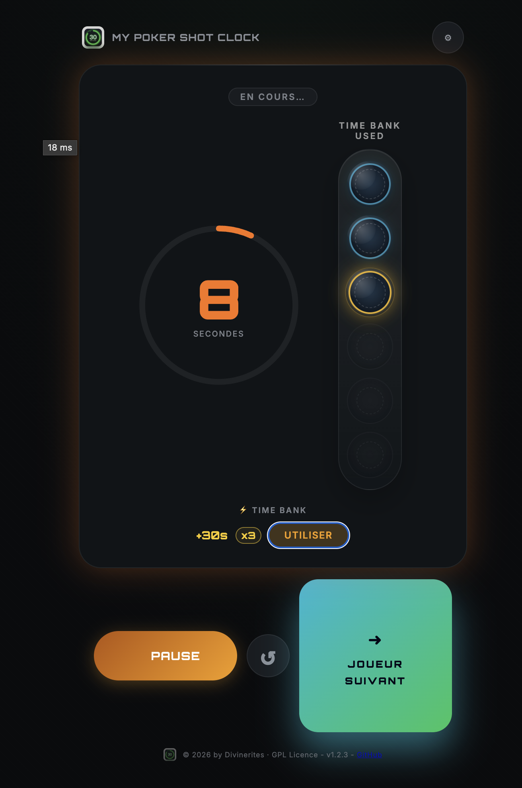

# 🃏 My Poker Shot Clock

> © 2026 by Divinerites — [GPL Licence](https://www.gnu.org/licenses/gpl-3.0.html)

Application web de shot clock poker, autonome, sans backend, 100% privacy-friendly.


Please, consider **leaving a star on Github if you like it**. 

[](https://star-history.com/#divinerites/my-poker-shot-clock&Date)

## Fonctionnalités

- ⏱ Shot clock configurable : 15 / 30 / 45 / 60 / 90 secondes
- ⚡ Time Bank par joueur (0 / 15 / 30 / 60s)
- 🎨 Couleurs progressives : vert → jaune → orange → rouge pulsant
- 🔊 Alertes sonores Web Audio API (bips à 10s, 5s, timeout)
- 📳 Vibration haptique (mobile)
- 💾 Persistance des préférences via `localStorage`
- 🌐 Bunny Fonts are now LOCAL.
- Affichage des time bank utilisé dans une main
- WebApp installable sur l'écran d'accueil
- Multi language : Français,English, Deutsch, Italiano, Русский, 简体中文, 语言, Nederlands, Čeština

## Screenshots

<p align="center">
  
  
  
</p>

<p align="center">
  
  
  
  
  
  
  
</p>

## Structure

```txt
my-poker-shot-clock/
├──
   ├── fonts              ← Local fonts
   ├── screenshots        ← Screenshot exemples
├── index.html            ← Structure HTML
├── style.css             ← Styles (dark theme, animations, responsive)
├── app.js                ← Logique JavaScript (timer, audio, localStorage)
├── sw.js.                ← Service Worker
├── shot_clock_logo.png   ← Logo
├── favicon.ico           ← Favicons
├── favicon-16.png        ←    "
├── favicon-32.png        ←    "
├── favicon-64.png        ←    "
├── manifest.webmanifest  ← PWA configuration
├── netlify.toml          ← En-têtes de sécurité HTTP
├── _redirects            ← Redirect for Plausible on Netlify
└── README.md
```

## Application

- Sources Github : https://github.com/divinerites/my-poker-shot-clock
- Application : https://mypokershotclock.netlify.app/

## WebApp

- Sur Chrome/Android, tu verras “Ajouter à l’écran d’accueil” avec un comportement d’app fullscreen.
- Sur iOS Safari, tu peux faire “Ajouter à l’écran d’accueil”

## Déploiement Netlify

1. Glisser le dossier sur [app.netlify.com](https://app.netlify.com/drop)
2. ✅ HTTPS automatique + headers sécurité via `netlify.toml`

## Usage local

Ouvrir `index.html` directement dans un navigateur.
> ⚠️ Certains navigateurs bloquent `localStorage` en `file://` — héberger sur Netlify pour la persistance.

## Licence

Ce projet est distribué sous licence [GNU GPL v3](https://www.gnu.org/licenses/gpl-3.0.html).
